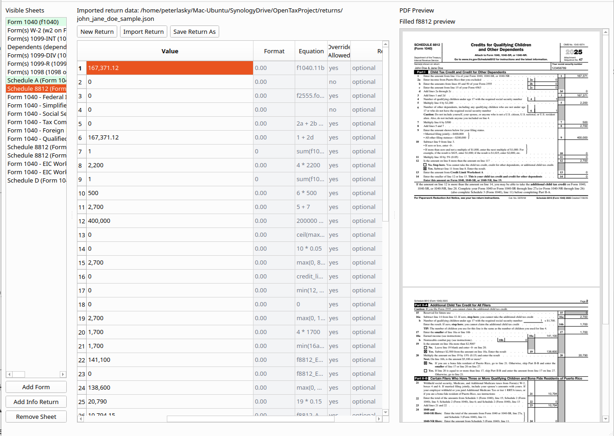

# Open Tax Project

```python src/main.py```

### The Challenge: 
Can an LLM figure out the US tax code?

Can a frontier model read all the relevant documents and build accurate, useable Federal tax software with minimal prompting?  

### Scope
Should have all the functionality of `TurboTax Premier`.

### Rules
  Create the shortest-possible plan.md that can guide an LLM from start to finish:
  - Creation of worksheets as described inside instructions and publications
  - Flow through so no duplicate entries are needed
  - Correctly linking lines and cells with formulas
  - GUI for data entry
  - Filling in of forms for filing in .pdf format
  - Enforce formatting rules, heirarchy rules, etc.
  - Have the program autofill pdfs of the forms required for filing.
  
  Optional:
  - Allow information returns to be entered initially by scanning .pdfs issued by employers, financial institutions, etc.

### Motivation
  - Test the limits of prompting on a highly complex project

### Verdict so far
  - I have tax software! But I no confidence it is correct.  
  - Oneshot was impossible.  With 3-4 evenings of prompting and refinement, I was able to work through the major issues. 
    
### Starting hints
  - a list of all the relevant forms, instructions, publications, and information returns (all links to .pdfs). Without this list, the model kept adding topics.  
  - a thorough description of a `pyside.qt`-based spreadsheet-like GUI to enter, calculate, and view, load, save, print.  

  

### To do
  - Check for errors generally against personal, professionally prepared returns.
  - W-2 has entry boxes where more than one category and value might appear.
  - Certain pdfs not displayed properly
  - Others

----------------------------------