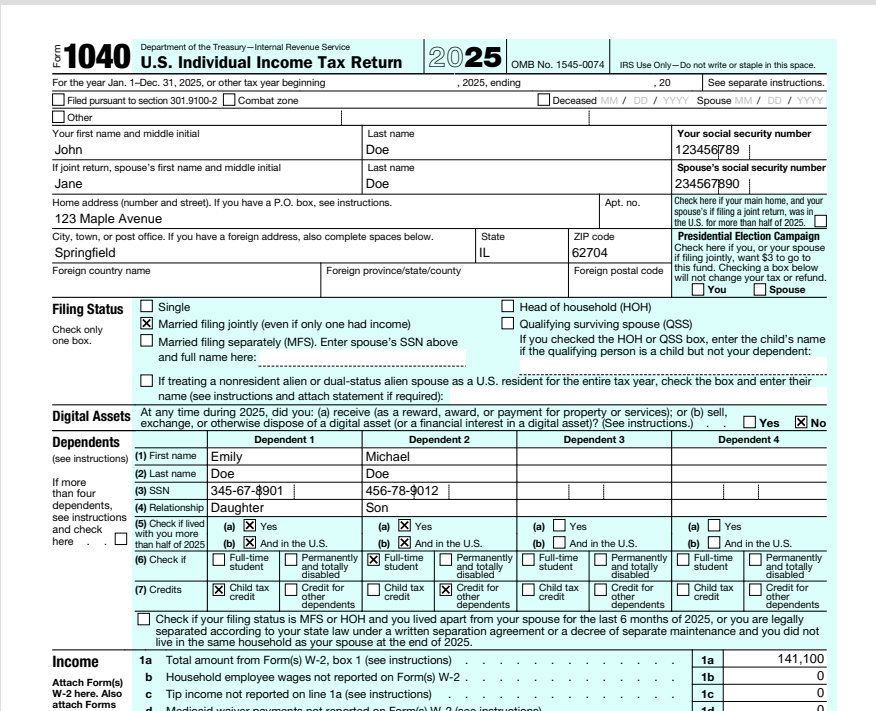

# Open Tax Project


### The Challenge: 
Prompt an LLM to figure out the US tax code for an indivual 1040 filer. 

### Scope
Should have all the functionality of `TurboTax Premier`.

### Sugggested Rules
  Create the shortest-possible plan.md that can guide an LLM from start to finish:
  - Determine a structure
  - Creation of worksheets as described inside instructions and publications
  - Flow through so no duplicate entries are needed
  - Correctly linking lines and cells with formulas
  - GUI for data entry
  - Filling in of forms for filing in .pdf format
  - Enforce formatting rules, heirarchy rules, etc.
  - Have the program autofill `pdf`'s of the forms required for filing.
  
  Optional:
  - Allow information returns to be entered initially by scanning .pdfs issued by employers, financial institutions, etc.

### Motivation
  - Test the limits of prompting on a highly complex project

### Result
  - I couldn't do it in anything like a oneshot.  Not without several evenings of reprompts and debugs.
  - I have tax software! Feels largely correct but not good enough to use for real.  
  </t> </t>```python src/main.py```
- The master file contains the entire structure:
  </t></t>`federal_1040_2025.json`
  It is easy to read and modify.  
 
- With 3-4 evenings of prompting and refinement, I was able to work through the major issues. 
    
### Starting hints
  - Provide a list of all the relevant forms, instructions, publications, and information returns (all links to .pdfs). Without this list, the model kept adding topics and (maybe) expand to the entire US Tax Code.
  - The process worked better when I had the model summarize the various instructions and publication `.pdf`'s into `.md` files and then work off the summaries.    
  - Give it a thorough description of a `pyside.qt`-based spreadsheet-like GUI to enter, calculate, and view, load, save, print. 

### Planning docs
  - Active planning now lives in `plans/README.md` and the plan files under `plans/`.
  - The root `plan.md` is retained as legacy historical context for now.

### To do
  - Check for errors generally against personal, professionally prepared returns.
  - Certain pdfs not displayed properly
  - Improve testing.  
  - Questionaire for adding topics.  There is no guidance to add certain forms the user might not know would provide savings.
  - Certain forms or worksheets only become necessary when a certain set of conditions are reached.  I need a way of activating/deactivating. 

----------------------------------